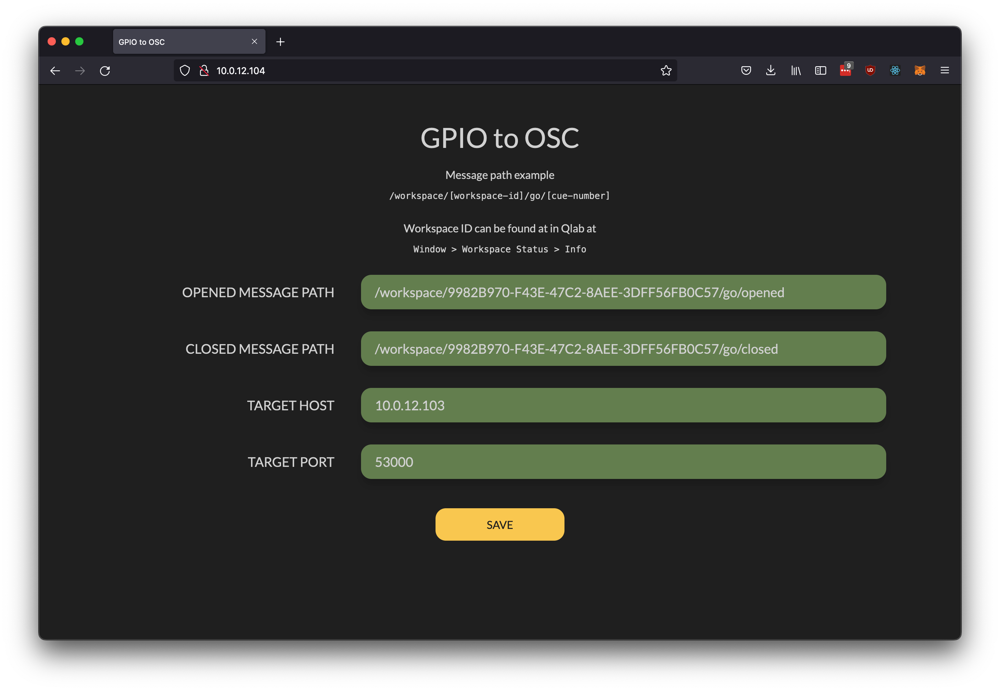
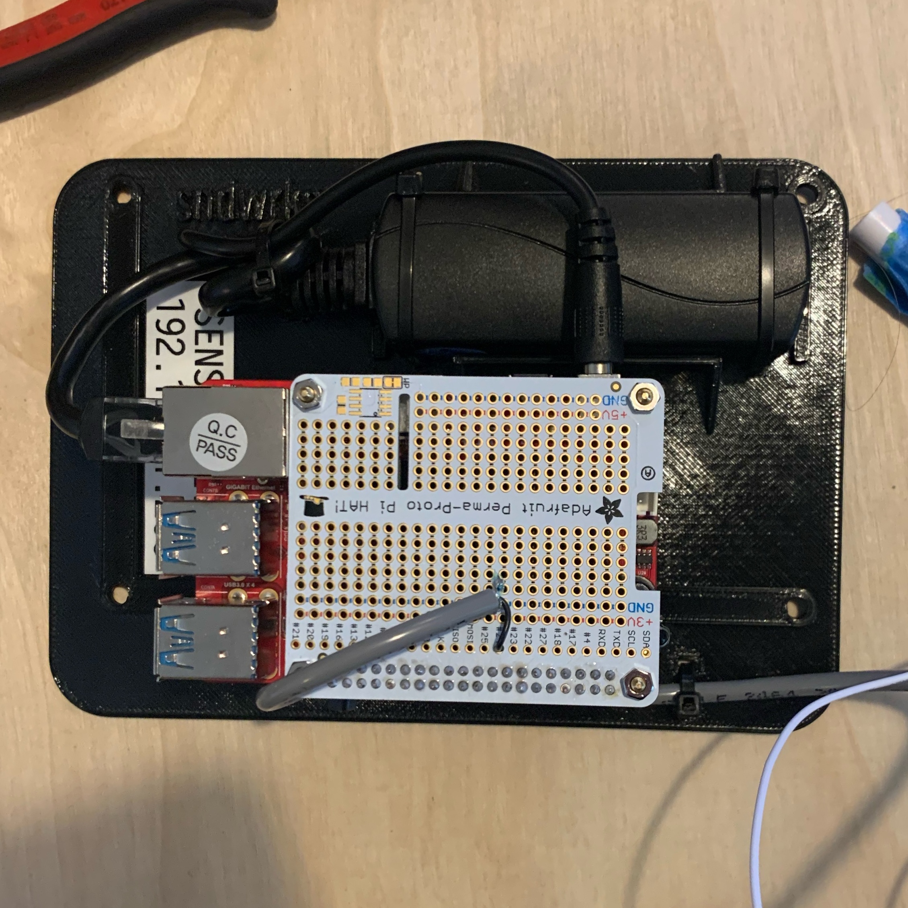

**TL;DR**
[Github](https://github.com/johnmckenna-snd/gpio-to-osc)

# Goal

I built this app when a friend at a theater company needed an easy way to trigger a door opening and closing that didn't involve MIDI. Currently, most often in shows when they need to trigger something, the use contact closures that send a MIDI messages. MIDI is very robust but very simple, and it has some problems like run length limitations. There aren't very many open source applications in the Theater industry, so I open sourced this so the community can make it better.

I wanted to develop a more modern way to receive triggers in playback software. So, I used a micro-computer powered by PoE that would connect to the show network in order to facilitate easy setup. The microcomputer serves a website from it's IP address for on-site configuration. Additionally, the microcomputer opens up and maintains a reverse ssh tunnel with a remote cloud server for remote management, monitoring, and configuration.

# Implementation

## Application

The Application is developed in Javascript and ran via Docker. I used node.js for the server, and React for the website (probably a bit overkill). I like using docker-compose to run apps because it makes it very easy.

## Hardware

For the first version of the hardware, I used a Odroid C4 though I would have preferred a Raspberry Pi they are too hard to find. A magnetic door sensor was used to trigger the GPIO. I used a PoE to 9V Barrel Connector to provide power. All the bits were mounted to a sled that I printed to allow the whole thing to be mounted to the set.

