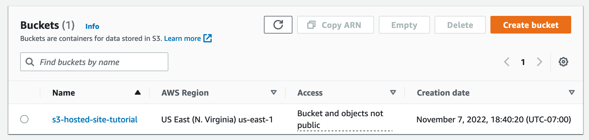
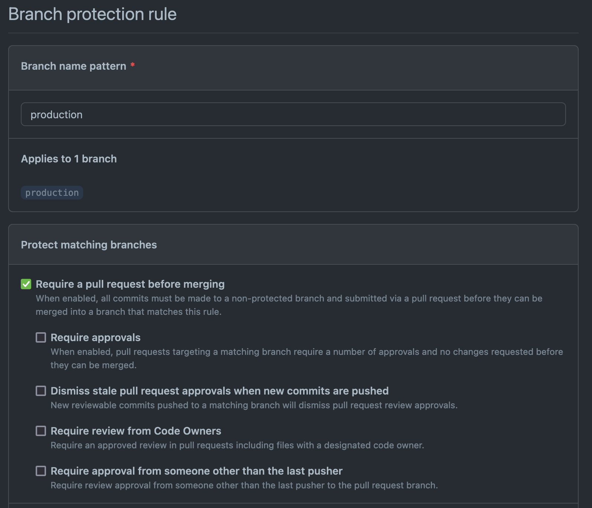

# Goal

The idea here is to serve a React app from an S3 bucket using Cloudfront as a CDN and deploy it via Github.

## What do you need?

There's a few bits you'll need before we start.

- AWS Account
- Github Account
- npm installed on your machine
- Basic knowledge of React and AWS

# Make the App

The first thing we'll need is a basic React app if you already have one you want to deploy you can skip this step.

## Create React App

You can use the `create-react-app` package to quickly bootstrap a React app.

```bash
$ npx create-react-app s3-hosted-site-tutorial
$ cd s3-hosted-site-tutorial
$ npm start
```

We'll navigate to `http://localhost:3000` just to make sure our site works.

## Add Boilerplate Github Action

Next, we'll add a file that describes what we want the Github action to accomplish. This action uses a Github action VM running Ubuntu to run some commands. It is triggered only when we push to the production branch. This is helpful because it allows development to continue unimpeded until it's time to push the app live to production.

First, it uses `actions/checkout` to pull the repo into the VM. Then, it removes the `package-lock.json` file. I like to do this step to make sure I'm getting the proper packages for the Host OS. I have encountered problems with different development environments muddying up a the `package-lock.json`. Then, it installs the npm packages and runs a build

After that, the action moves into AWS territory. It first uses an action from AWS to setup the Credentials on the VM. Then, it performs a S3 sync to push the built code into the bucket. After that, the VM invalidates the previous Cloudfront cache. This is a very important step because we have to tell Cloudfront we've updated the contents of the bucket and all the information is has cached at the edge is no longer current. 

**Create the File**

1. Create a `.github` directory in your root project folder
2. Create a `workflows` directory in the `.github` folder
3. Finally create a file `deployToAWS.yml` in the `workflows` folder and paste the following in below. We will need to update some info in here after we create the resources on AWS.

```yaml
name: deployToAWS

on:
  push:
    branches:
      - production

jobs:
  build:
    runs-on: ubuntu-latest

    steps:
      - uses: actions/checkout@v3
      - run: rm package-lock.json
      - run: npm install
      - run: npm run build
        env:
          CI: false

      - name: Configure AWS credentials
        uses: aws-actions/configure-aws-credentials@v1
        with:
          aws-access-key-id: ${{ secrets.AWS_ACCESS_KEY_ID }}
          aws-secret-access-key: ${{ secrets.AWS_SECRET_ACCESS_KEY }}
          aws-region: ${{ secrets.AWS_REGION }}

      - name: AWS S3 Sync
        run: aws s3 sync build s3://${{ secrets.AWS_S3_BUCKET_NAME }}/

      - name: AWS Cloudfront Invalidation
        run: aws cloudfront create-invalidation --distribution-id ${{ secrets.AWS_DISTRIBUTION_ID }} --paths "/index.html"
```

4. Now, push this repo up to Github.

Alright, that's all we need to do with Github for now.

# AWS Setup

Now, we'll move over to the AWS side of things. Login to your AWS account.

## Create S3 Bucket

First thing we need to do is to create an S3 Bucket. This is where our website will be hosted. Make sure you know which region you're creating this S3 bucket in we'll need that for Github at the end.

1. Navigate to the S3 Management Console, if this is your first time going to S3 you may see a more marketing centric page. 

2. Find the **Create Bucket** button in your window, go on mash that button.

3. AWS S3 buckets are globally unique, so we'll name ours something like `s3-hosted-site-tutorial`. We don't have to change any settings yet, so scroll to the bottom and hit **Create Bucket**

### Adjust Bucket Settings

Now, you should have been redirected to the S3 management console, and your view should look something like this.



If that looks right, let's change some settings to make the bucket ready for static hosting.

1. Click on the bucket name to view the bucket details and click on the Properties tab. Scroll down to the static hosting section (it's at the bottom).

2. Change the radio to enable and then specify `index.html` as the Index Document. The Error Document can be left blank for now, but it is good to note that your React app should have some way to handle 404 errors.

3. Click Save Changes at the bottom and our S3 configuration is complete. In properties, copy the ARN (Amazon Resource Name) somewhere as we'll need this later for the Cloudfront distribution.

It'll look something like this: `arn:aws:s3:::s3-hosted-site-tutorial`

Sweet let's setup the CDN.

## Cloudfront Setup

Go ahead and make your way to the Cloudfront Console. Cloudfront is a CDN that we'll use to actually serve the site.

### Make a New Distribution

Now, we'll create a new Cloudfront distribution that will use the S3 bucket as a data source.

1. Click the **Create a CloudFront distribution** button

2. For the Origin domain, select the S3 bucket we created in the last section.

3. We can leave the name same

The next section, Origin Access, is how Cloudfront accesses the data from the S3 bucket. Public is the default option and sometimes we want this for example with Gatsby sites, but the preferred option is the Origin access control so that the bucket restricts access to just the Cloudfront distribution.

1. Change the Radio to Origin access control settings

2. Click **Create control setting**, then click **Create**

3. Note that we'll have to update the Bucket policy after we create the distribution

Now, we'll be updating the cache settings for our distribution.

1. Change the Viewer protocol policy to **Redirect HTTP to HTTPS**

Finally, we need to point Cloudfront to the `index.html` file we specified earlier in our bucket setup. 

1. Scroll down to Settings

2. Put `/index.html` in the Default root object field

Now, we can click **Create distribution**, and we're off to the races. It will take AWS a minute or two to create the distribution, so let's go update that bucket policy.

1. A bar will appear at the top of the screen saying the S3 bucket policy needs to be updated.

2. Click **Copy policy** and navigate to the S3 bucket

3. Under the Permissions tab, click **Edit** on the Bucket policy

4. Click save

You're policy will look something like this: 

```json
{
  "Version": "2008-10-17",
  "Id": "PolicyForCloudFrontPrivateContent",
  "Statement": [
      {
          "Sid": "AllowCloudFrontServicePrincipal",
          "Effect": "Allow",
          "Principal": {
              "Service": "cloudfront.amazonaws.com"
          },
          "Action": "s3:GetObject",
          "Resource": "arn:aws:s3:::s3-hosted-site-tutorial/*",
          "Condition": {
              "StringEquals": {
                "AWS:SourceArn": "arn:aws:cloudfront::268675373274:distribution/E3HVOWYX90TQCG"
              }
          }
      }
  ]
}
```

## Create the IAM User

IAM users allow granting of permissions for programmatic access and permission control. The idea here is that we want an IAM account with the least permissions possible so that if it's compromised an attacker can't do much damage.

1. Navigate to the IAM console

2. In the side-nav, click Users then click **Add User**

3. Name this user something, for this tutorial. I used `s3-hosted-site-tutorial`. Check the box for Access Key - Programmatic access and click **Next: Permissions**

4. Select Attach existing policies directly and click **Create Policy**

Now, in the new tab, we'll create our policy to attach to the IAM account. We'll need the ARN's from the S3 bucket and the Cloudfront distribution.

1. Get your S3 ARN and your Cloudfront ARN

2. Copy the JSON below and replace the ARNs

```json
{
  "Version": "2012-10-17",
  "Statement": [
    {
        "Sid": "PolicyForS3HostedSiteTutorial",
        "Effect": "Allow",
        "Action": [
            "s3:PutObject",
            "s3:GetObject",
            "cloudfront:CreateInvalidation"
        ],
        "Resource": [
            "arn:aws:s3:::s3-hosted-site-tutorial/*",
            "arn:aws:cloudfront::268675373274:distribution/E3HVOWYX90TQCG"
        ]
    },
    {
        "Sid": "PolicyForGithubAction",
        "Effect": "Allow",
        "Action": "s3:ListBucket",
        "Resource": "arn:aws:s3:::s3-hosted-site-tutorial"
    }
  ]
}
```

3. Click **Next: Tags** then **Next: Review**. I'll name this policy `s3-hosted-site-tutorial`

4. Click **Create policy**

5. Close that tab and go back to the IAM account creation tab.

6. Refresh the policy list and search for the policy you just created

7. Click **Next: Tags** then **Next: Revew**. If everything looks good, click **Create user**

Now, AWS will show you a screen with the Access key ID and the Secret Access Key. You should store these somewhere safe like a password manager. We'll need them in the next section when we update our Github repo.

# Finalize Github Repo

Head back over to the Github repo you pushed earlier. We need to update some Action environment variables so that the Github action can run.

1. Click on the Settings tab and Open the secrets section in the Sidebar

2. Click on Secrets -> Actions

We need to add five secrets here for the Github Action to function:
1. `AWS_ACCESS_KEY_ID`: This is from the IAM account creation
2. `AWS_SECRET_ACCESS_KEY`: This is the secret from the IAM account creation
3. `AWS_REGION`: This is the region you created the bucket in (i.e. us-east-1)
4. `AWS_DISTRIBUTION_ID`: This is the Cloudfront Distribution ID (i.e. E3HVOWYX90TQCG)
5. `AWS_S3_BUCKET_NAME`: The name of your bucket (i.e. s3-hosted-site-tutorial)

Sweet now all we need is a production branch in our repo to trigger the Action.

1. Navigate to the Code tab in your repo

2. In the branch selection dropdown, type production in to the search box to create a new branch. 

3. This will create a new branch from the main branch and trigger the action.

Hopefully, the action works on the first time. If not, don't worry, check to make sure you inputted all the variables in right.

## Bonus: Protect the Production Branch

You may want to protect the production branch in Github. This prevents pushing directly to the production branch on action and require a pull request be opened to merge into the production brand.

1. Navigate to the Settings tab in your repo

2. Click Branches in the sidebar then click **Add rule**

3. Your rule should look like this below you don't need any other check boxes other than Require a pull request before merging



# Hooray

You did it! This is cause for celebration, or maybe a nap.

