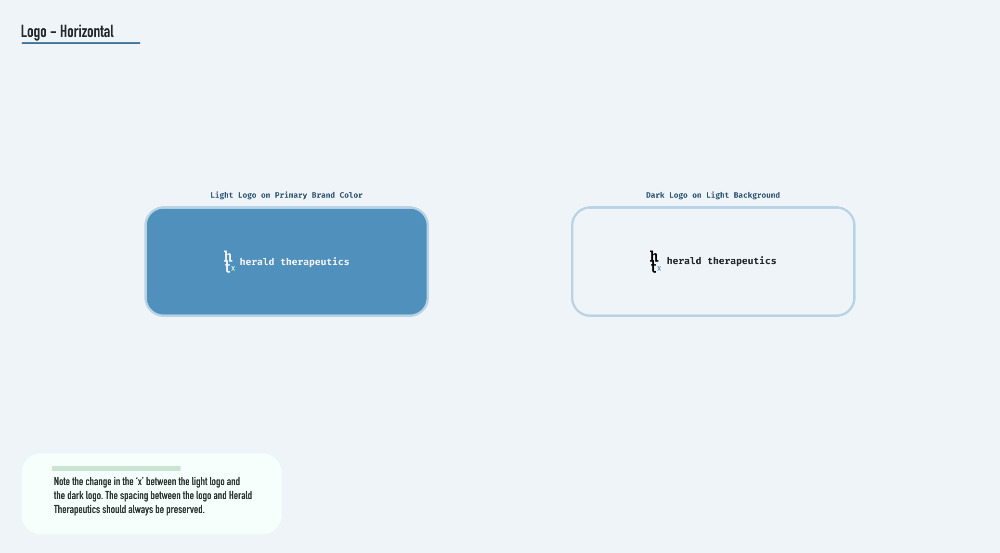
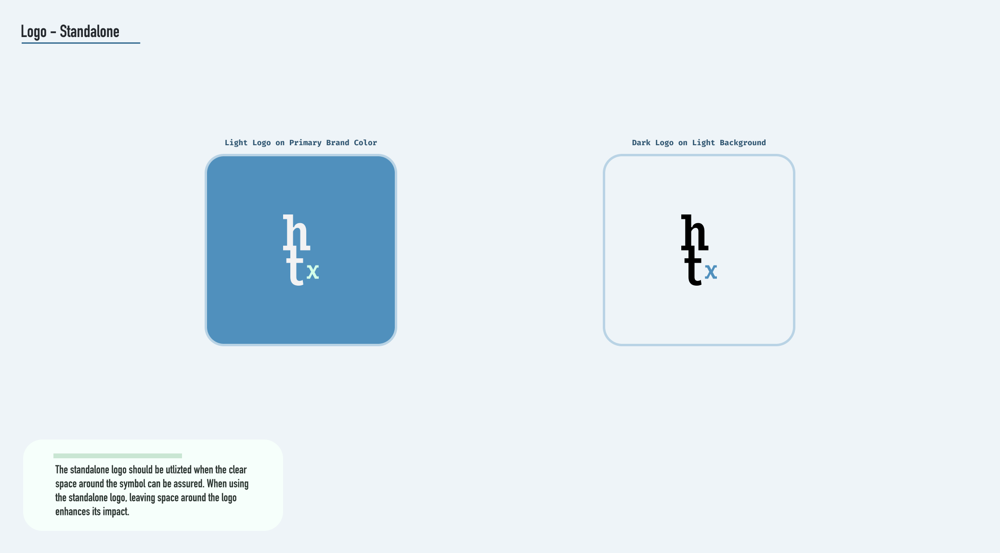
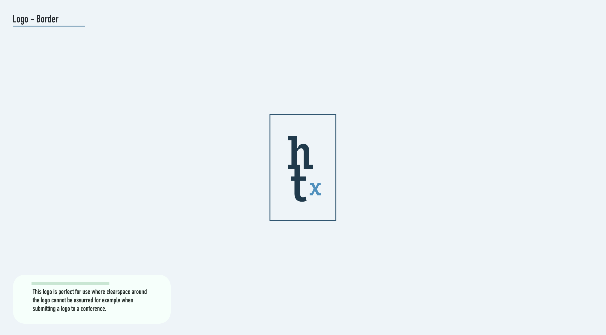
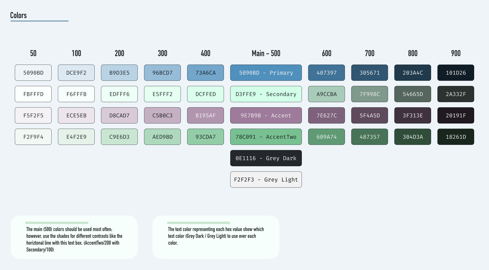
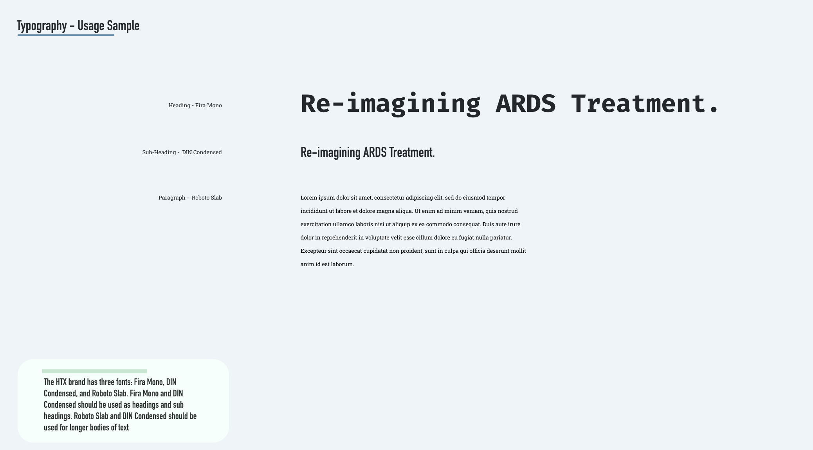

# Overview

My company sndwrks was contracted by a bio-medical Startup, Herald Therapeutics, Inc, to design and develop the branding, logo, and website.

[Herald Website](https://www.heraldtx.com)

# Logo

After a bunch of options, the CEO chose a monograph logo style for it's simplicity and easy recognition.

## Horizontal

## Standalone

## Standalone with Border

# Branding

The colors and typography were chosen to show the cutting-edge treatments with a refined color palette to exude experience.

## Color

## Typography

