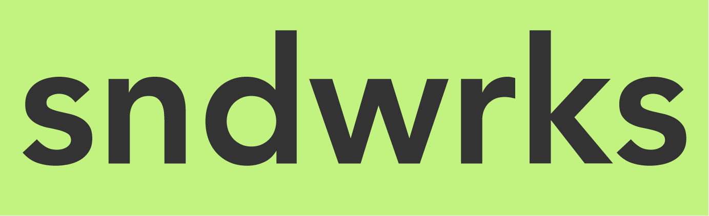
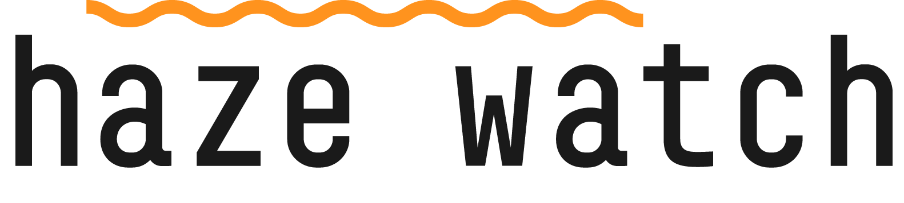

# Overview

[Website](https://www.sndwrks.xyz)

I founded sndwrks (sound works) back when I was working in the theater industry. I used sndwrks for consulting, and I also sold a Filemaker-based application to the theater industry for show management.

Then, as I learned web development, the company slowly changed headings. Today, sndwrks has multiple products and services. The product furthest along is Haze Watch which is an IoT solution to monitor Live Event atmospherics (i.e. smoke, fog, and haze). sndwrks has made custom one-off products for clients, and there's a line of furniture in prototype.

sndwrks additionally has consulted for TV Stations, eCommerce businesses, startups, and theatrical productions.

# Featured Product

Haze Watch is an IoT solution based around Raspberry Pi's, a small local server, a remote server, and sensors. The sensors send metrics to the local server via socket.io. The local server also serves a website for viewing on the local network. The remote server is used for administration, metrics, and data backup.