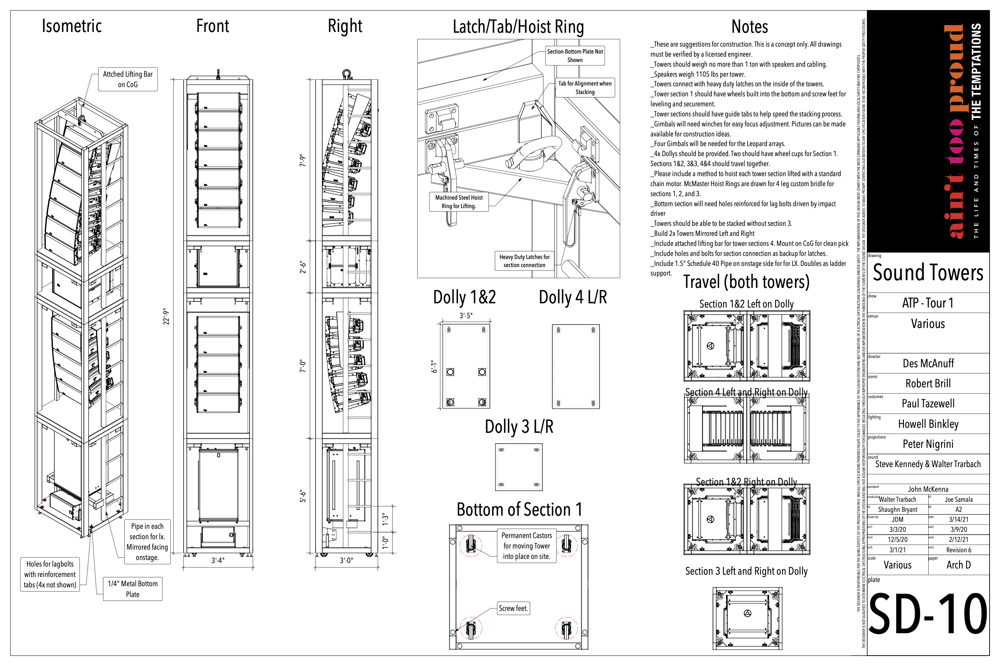
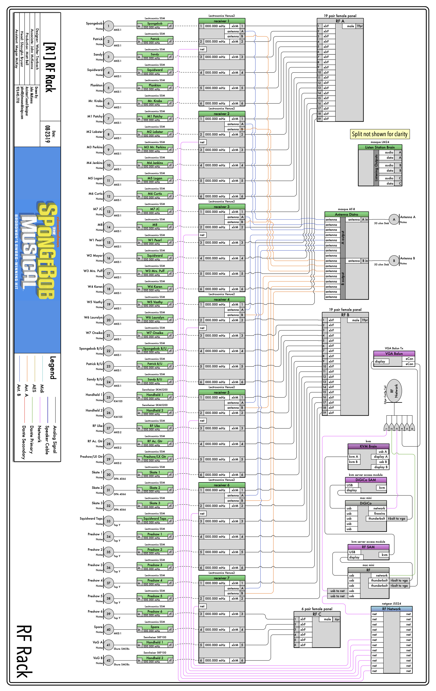

# Overview

For over 10 years, I worked in live entertainment most often as a Theatrical Sound Designer. From Broadway to the smallest club, I have broad experience deploying, managing, and designing sound systems. In addition, I have designed many shows which includes content creation and curation.

# Selected Shows

Here's a small selection of shows that I was involved with:

## Ain't Too Proud

I worked in live entertainment, for over ten years, principally as a Theatrical Sound Designer. From Broadway, to the small clubs, I have broad experience deploying, managing, and designing sound systems. In addition, I designed many shows doing content creation and curation.

Here's an example of a drawing:

### Credits

**Director** 
Des McAnuff

**Scenic Design** 
Robert Brill

**Costume Design** 
Paul Tazewell

**Lighting Design** 
Howell Binkley

**Sound Design** 
Steve Canyon Kennedy and Walter Trarbach

**Projection Design** 
Peter Nigrini

## SpongeBob the Musical (1st National Tour)

SpongeBob the Musical is a hero's journey where SpongeBob and friends battle a volcano named Mount Humongous. As Associate Sound Designer, my work involved creating system drawings, sound effect modification, multi-track playback programming, and show control programming.

Here's a signal flow from the show:

### Credits

**Director** 
Tina Landau

**Scenic & Costume Design** 
David Zinn

**Lighting Design** 
Kevin Adams

**Sound Design** 
Walter Trarbach

**Projection Design** 
Peter Nigrini

## The Tempest - The Julliard School

The director wanted this show deconstructed with little realistic scenery. Initially, we used sound effects to help define the abstraction, but eventually, we transitioned to having the actors do all the sound effects with objects found on the set.

Here are some sound effects before they were moved to the actors:

**The Tempest**

`audio: https://john-mckenna-portfolio-audio.s3.amazonaws.com/tempest_q1-2.5.mp3`

**Banquet Scene**

`audio: https://john-mckenna-portfolio-audio.s3.amazonaws.com/tempest_q65-66.2.mp3`

### Credits

**Director** 
Jenny Koons

**Scenic Design** 
Jason Simms

**Costume Design** 
Nina Vartanian

**Lighting Design** 
Paul Hudson

**Sound Design** 
Me!