# Overview

To learn more about UI/UX, I have done studies where I looked at a problem and mocked up a solution app or page.

# Captains Log

Captains Log is a concept my former boss came up with: a need to log website links with just a bit more information than bookmarks. I made a mockup of the UI.

## Log

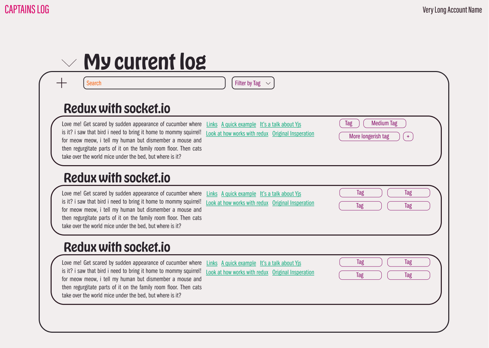

## Logs List

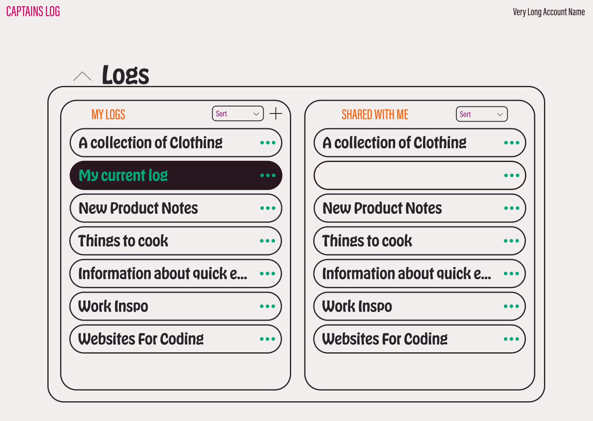

## Log Detail

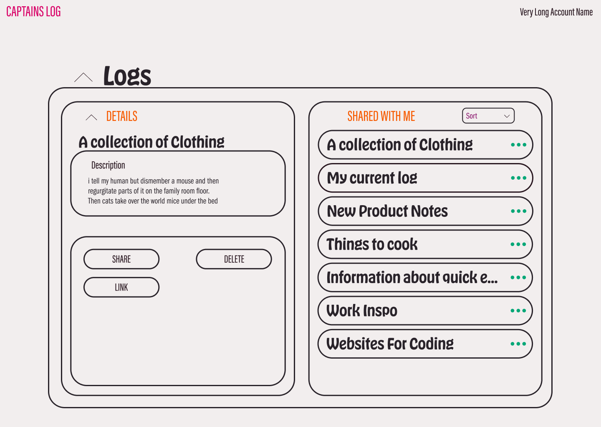

## Profile

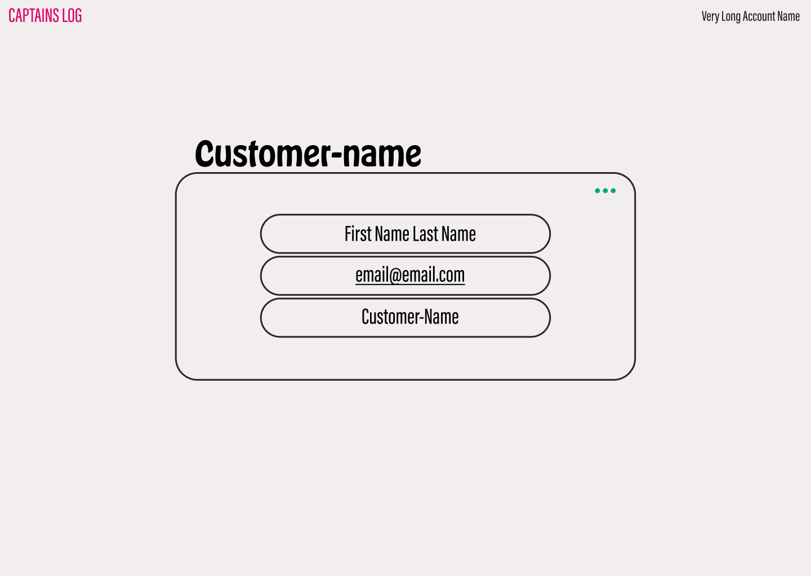

## Login One

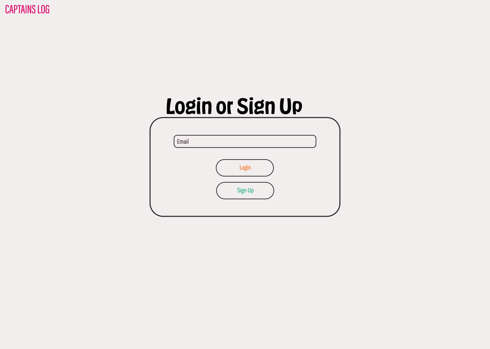

## Login Two

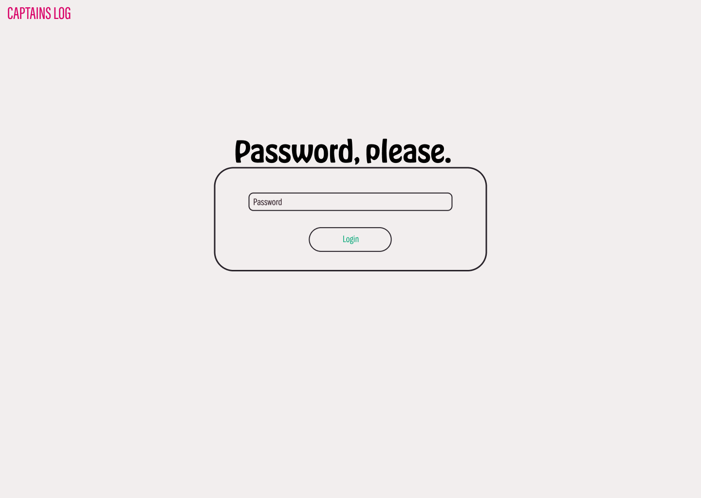

# Dudes Eat

Dudes Eat materialized as an open-source food blog. The project would be on GitHub, and anyone could contribute via pull request. There will be people to cook and approve the merge of a new recipe.

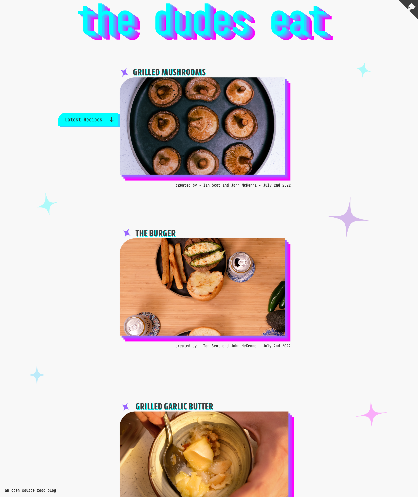

# Kairos

Kairos was my first UI/UX study. I enjoy cooking, and I wanted to have multiple timers going at once in a single app. After trying a bunch of options, I decided to design my own.

Over a year ago, I attempted to build it, but my development skills weren't good enough. I had trouble managing multiple timers in React. I will revisit it soon, using the context as a central store for the timers now that my development skills have significantly improved.

## New Timer - No Timers

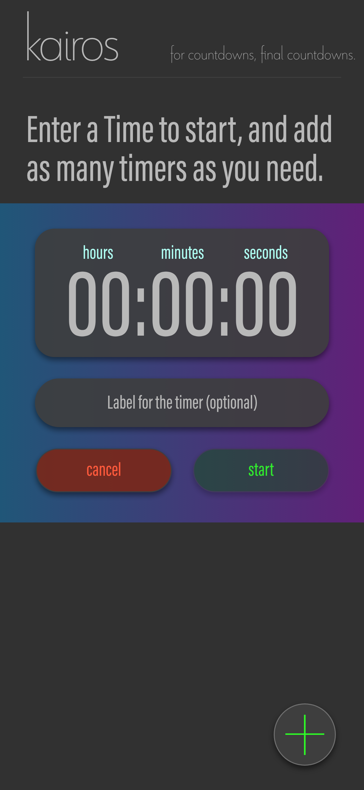

## Timer List

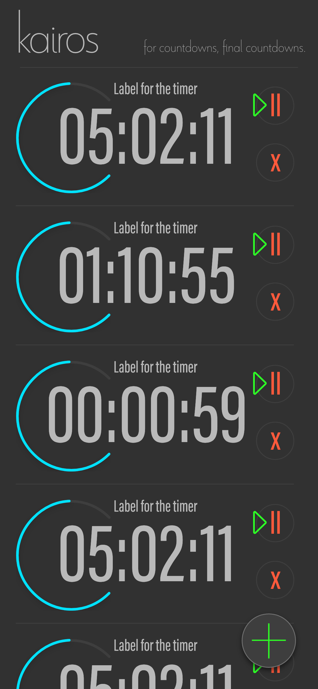

## New Timer - Timers Already Running

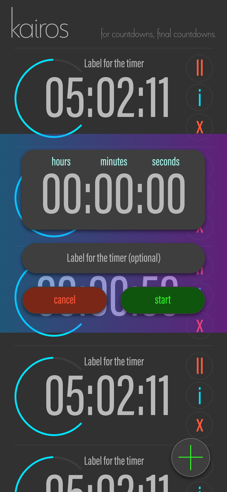

## Timer Complete

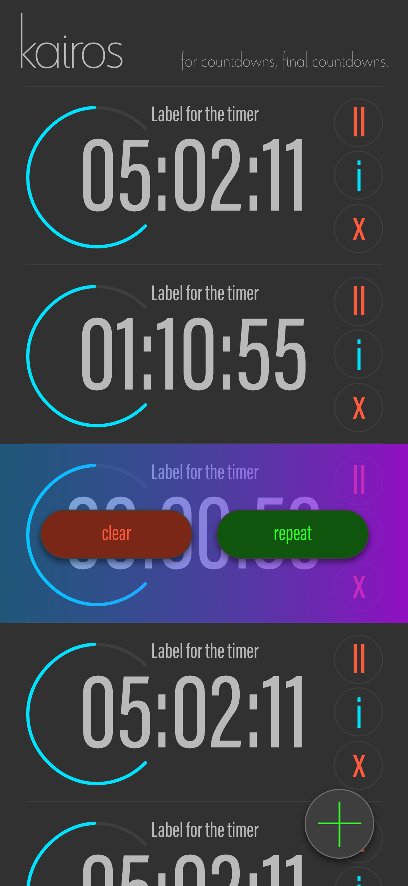